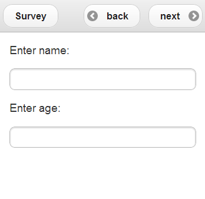

# ODK-X Survey

This project is __*actively maintained*__

**ODK-X Survey** is an Android application for performing data collection in the ODK-X framework. 
It operates similarly to ODK Collect, but is based on HTML, CSS, and Javascript rather than native Android, and is more flexible in its presentation and execution. 
It is part of the ODK-X Android tools suite.

## Table of Contents
- [Getting Started](#getting-started)
  - [Quick access](#quick-access)
  - [Instructions on how to use Survey](#instructions-on-how-to-use-survey)
  - [Setting up your environment](#setting-up-your-environment)
  - [Building the project](#building-the-project)
  - [Running](#running)
  - [Android Version Compatibility](#android-version-compatibility)
- [Source Tree Information](#source-tree-information)
- [How to Contribute](#how-to-contribute)
- [FAQs](#faqs)
- [Links for Users](#links-for-users)

## Quick access

- **[Prerequisites:](https://docs.odk-x.org/survey-using/#prerequisites)**
  - Prerequisites refer to the necessary conditions or requirements that must be met before you can effectively use ODK-X Survey. These may include having the ODK-X Application Suite installed on your Android device and having a basic understanding of how Android devices work.

- **[Using ODK-X Survey:](https://docs.odk-x.org/survey-using/#using-odk-x-survey)**
  - Using ODK-X Survey involves the actions and procedures for creating, managing, and conducting surveys on Android devices using the ODK-X Survey application.

- **[Opening a Form:](https://docs.odk-x.org/survey-using/#opening-a-form)**
  - Opening a Form means launching the ODK-X Survey app and selecting a specific survey form from the list of available forms to begin data collection or data entry.

    - **[Opening a Subform:](https://docs.odk-x.org/survey-using/#opening-a-subform)**
        - Opening a Subform is the process of accessing and filling out a secondary or nested form within a primary survey form. Subforms are used for collecting related data within the main survey.

- **[Ordering Forms List:](https://docs.odk-x.org/survey-using/#ordering-forms-list)**
  - Ordering Forms List refers to the process of arranging the list of available survey forms in a specific order, such as by name, date, or other criteria, to make it easier to locate and select forms.

- **[Saving a Form Instance:](https://docs.odk-x.org/survey-using/#saving-a-form-instance)**
  - Saving a Form Instance involves preserving the progress made in filling out a survey form. It allows users to save partially completed forms and resume data entry at a later time.

- **[Viewing Saved Form Instances:](https://docs.odk-x.org/survey-using/#viewing-saved-form-instances)**
  - Viewing Saved Form Instances is the action of accessing and reviewing survey forms that have been partially or fully filled out and saved on the device but have not yet been submitted.

    - **[Editing Saved Form Instances:](https://docs.odk-x.org/survey-using/#editing-saved-form-instances)**
        - Editing Saved Form Instances means making changes or updates to previously saved survey forms. It allows users to modify responses or correct errors in completed forms.

    - **[Deleting Saved Form Instances:](https://docs.odk-x.org/survey-using/#deleting-saved-form-instances)**
        - Deleting Saved Form Instances involves removing survey forms that have been saved but are no longer needed. It helps manage the storage space on the device.

- **[Navigating a Form:](https://docs.odk-x.org/survey-using/#navigating-a-form)**
  - Navigating a Form refers to the process of moving through a survey form, including progressing from one question to the next, jumping to specific sections, or using navigation buttons.

- **[Syncing Forms and Data:](https://docs.odk-x.org/survey-using/#syncing-forms-and-data)**
  - Syncing Forms and Data involves uploading collected survey data from the device to a remote server or cloud storage to ensure data integrity and share data with others.

- **[Setting up a Form Development Environment:](https://docs.odk-x.org/survey-using/#setting-up-a-form-development-environment)**
  - Setting up a Form Development Environment includes configuring the necessary tools and resources for designing, creating, and testing survey forms before deploying them for data collection.

- **[Designing a Form:](https://docs.odk-x.org/survey-using/#designing-a-form)**
  - Designing a Form is the process of creating the structure and content of a survey form, including defining questions, answer options, skip logic, and form layout.

    - **[Full XLSX Reference:](https://docs.odk-x.org/survey-using/#full-xlsx-reference)**
        - Full XLSX Reference provides comprehensive documentation and guidance on the format and structure of XLSX files used for defining survey forms in ODK-X Survey.

- **[Launching With a Different AppName:](https://docs.odk-x.org/survey-using/#launching-with-a-different-appname)**
  - Launching With a Different AppName involves customizing the name by which ODK-X Survey is launched on the device. This can be useful for distinguishing between different instances of the application.

    - **[Android 4.x Devices:](https://docs.odk-x.org/survey-using/#android-4-x-devices)**
        - Android 4.x Devices refer to Android devices running versions in the 4.x series (e.g., Android 4.0, 4.1, etc.). ODK-X Survey may have specific compatibility considerations for these devices.

    - **[Android 5.x and Higher Devices:](https://docs.odk-x.org/survey-using/#android-5-x-and-higher-devices)**

        - Android 5.x and Higher Devices refer to Android devices running versions 5.0 (Lollipop) and later. These devices are typically more capable and may offer improved performance for ODK-X Survey.

    - **[Trying the New Launcher:](https://docs.odk-x.org/survey-using/#trying-the-new-launcher)**

        - Trying the New Launcher involves experimenting with an updated launcher interface for ODK-X Survey, which may offer improved user experience and features.

    - **[Making a New AppName:](https://docs.odk-x.org/survey-using/#making-a-new-appname)**
        - Making a New AppName is the process of creating a custom name or identifier for an instance of ODK-X Survey. It allows you to differentiate between different projects or deployments of the application.

## Instructions on how to use Survey.

Note: Detailed information on how to use the survey can be found [here](https://docs.odk-x.org/survey-using/).

- **Install ODK-X Survey:**
  - Install the ODK-X Survey application on your Android device from the Google Play Store.

- **Design Your Survey Form:**
  - Create your survey form using XLSForm syntax. You can use tools like ODK-X XlSX converter or manually create an XLSForm using a spreadsheet program like Microsoft Excel or Google Sheets.

  - Define the survey questions, specify question types (text, numeric, multiple-choice, etc.), set constraints, and add skip logic if needed.

    ### csv-table: Example Spreadsheet

    | type        | name | display.prompt.text |
    |-------------|------|---------------------|
    | begin screen|      |                     |
    | text        | name | Enter name:         |
    | integer     | age  | Enter age:          |
    | end screen  |      |                

    Will result in a survey like this:
    
    

- **Move Your Survey Form To Device:**
   - After designing your survey form, move it to the ODK-X Survey application.
   You can do this by connecting your Android device to a computer and copying the XLSForm file to the appropriate directory on the device or by using a file-sharing service.

- **Configure Settings:**
    - Configure the settings of your survey project, including form-specific settings, device-specific settings, and server settings if you are using a server for data storage and synchronization.

- **Collect Data:**
    -  Open the ODK-X Survey app on your Android device.
    - Select the survey form you want to use from the list of available forms.
    - Fill out the survey form on the device by collecting responses from respondents.
    The app will guide you through the survey, and you can save collected data on the device.

- **Submit Data:**
    - Once the survey is completed, you can submit the collected data. 
    Depending on your configuration, you can submit data to a server for centralized storage and analysis or export it as files for further analysis.

The developer [wiki](https://github.com/odk-x/tool-suite-X/wiki) (including release notes) and
[issues tracker](https://github.com/odk-x/tool-suite-X/issues) are located under
the [**ODK-X Tool Suite**](https://github.com/odk-x) project.

Engage with the community and get technical support on [the ODK-X forum](https://forum.odk-x.org)

## Setting up your environment

General instructions for setting up an ODK-X environment can be found at our [Developer Environment Setup wiki page](https://github.com/odk-x/tool-suite-X/wiki/Developer-Environment-Setup)

Install [Android Studio](http://developer.android.com/tools/studio/index.html) and the [SDK](http://developer.android.com/sdk/index.html#Other).

This project depends on ODK-X's [androidlibrary](https://github.com/odk-x/androidlibrary) and [androidcommon](https://github.com/odk-x/androidcommon) projects; their binaries will be downloaded automatically fom our maven repository during the build phase. If you wish to modify them yourself, you must clone them into the same parent directory as survey. Your directory structure should resemble the following:

        |-- odk-x

            |-- androidcommon

            |-- androidlibrary

            |-- survey

  * Note that this only applies if you are modifying the library projects. If you use the maven dependencies (the default option), the projects will not show up in your directory. 

ODK-X [Service](https://github.com/odk-x/services) __MUST__ be installed on your device, whether by installing the APK or by cloning the project and deploying it. [Tables](https://github.com/odk-x/tables) also integrates well with ODK-X Survey, but is not required.

Now you should be ready to build.

## Building the project

Open the Survey project in Android Studio. Select `Build->Make Project` to build the app.

## Running

Be sure to install ODK-X Core onto your device before attempting to run Survey.

## Source tree information
Quick description of the content in the root folder:

    |-- survey_app     -- Source tree for Java components

        |-- src

            |-- main

                |-- res     -- Source tree for Android resources

                |-- java

                    |-- org

                        |-- opendatakit

                            |-- survey

                                |-- android     -- The most relevant Java code lives here
                                
            |-- androidTest    -- Source tree for Android implementation tests

## How to contribute
If you’re new to ODK-X you can check out the documentation:
- [https://docs.odk-x.org](https://docs.odk-x.org)

Once you’re up and running, you can choose an issue to start working on from here: 
- [https://github.com/odk-x/tool-suite-X/issues](https://github.com/odk-x/tool-suite-X/issues)

Issues tagged as [good first issue](https://github.com/odk-x/tool-suite-X/issues?q=is%3Aissue+is%3Aopen+label%3A%22good+first+issue%22) should be a good place to start.

Pull requests are welcome, though please submit them against the development branch. We prefer verbose descriptions of the change you are submitting. If you are fixing a bug, please provide steps to reproduce it or a link to an issue that provides that information. If you are submitting a new feature, please provide a description of the need or a link to a forum discussion about it.

## FAQs
1. **What is ODK-X Survey?**

    ODK-X Survey is an open-source, customizable data collection tool designed for Android devices. It allows users to create and manage structured data collection forms for various purposes, including surveys, assessments, and research.

2. **How is ODK-X Survey different from ODK Collect?**

    ODK-X Survey is an Android application for performing data collection in the ODK-X framework. It operates similarly to ODK Collect, but is based on HTML, CSS, and Javascript rather than native Android, and is more flexible in its presentation and execution

3. **What are the key features of ODK-X Survey?**

    ODK-X Survey offers features such as advanced form design, support for nested forms (subforms), customizable user interfaces, data synchronization and integration with ODK-X Tables for data management.

4. **How do I create a form in ODK-X Survey?**

    Forms in ODK-X Survey are typically created using XLSX files that define the form's structure, questions, and logic. You can design forms by manually editing XLSX files and convert them using ODK-X XLSX converter.

5. **Can I use ODK-X Survey offline?**

    Yes, ODK-X Survey is designed to work offline. Users can collect data in areas with limited or no internet connectivity, and the collected data can be synchronized with a server when an internet connection is available.

6. **What is the process for syncing data with a server?**

    To sync data, users need to establish an internet connection, open the ODK-X Survey app, and tap the "Sync" button. This action uploads collected data to a server or cloud storage, ensuring data is securely stored and backed up.

7. **Is it possible to customize the appearance of survey forms in ODK-X Survey?**

    Yes, ODK-X Survey allows for extensive customization of form appearance, including colors, fonts, and logos. You can tailor the user interface to match your organization's branding.

8. **What is a subform, and how do I use it in ODK-X Survey?**

    A subform in ODK-X Survey is a nested form within a primary form. It is used for collecting related data. You can open a subform within a main form, making it useful for scenarios where you need to collect multiple sets of data within a single survey.

9. **Can I edit and review saved form instances in ODK-X Survey?**

    Yes, ODK-X Survey allows you to edit saved form instances, review their contents, and make modifications as needed. This feature is helpful for correcting errors or updating data.

10. **How do I design complex surveys with skip logic and conditional branching?**
    
    ODK-X Survey supports skip logic and conditional branching through XLSX files. You can define skip patterns and conditions within the XLSX form definition to create complex survey flows.

11. **What is the difference between ODK-X Survey and ODK-X Tables?**
    
    ODK-X Survey is primarily used for data collection, while ODK-X Tables is used for managing and viewing data collected through ODK-X Survey. Tables provides a more structured way to work with data, including data synchronization and viewing capabilities.

12. **Is technical support available for ODK-X Survey?**

    ODK-X has an active community, and support is available through forums and online documentation. Users can seek help from the ODK-X community for troubleshooting and guidance.

13. **Can I create custom survey applications using ODK-X Survey as a base?**

    Yes, you can build custom survey applications using ODK-X Survey as a foundation. ODK-X is open source, allowing you to modify and extend its features to meet specific project requirements.

14. **What Android versions are supported by ODK-X Survey?**

    ODK-X Survey is compatible with Android 4.x devices as well as Android 5.x and higher devices. Compatibility may vary depending on the specific version of ODK-X Survey you are using.

15. **How do I migrate data from ODK Collect to ODK-X Survey?**

    Data migration between ODK Collect and ODK-X Survey may require converting form definitions and adapting data structures. It is recommended to consult the ODK-X documentation and community for guidance on migration processes.

## Links for users
This document is aimed at helping developers and technical contributors. For information on how to get started as a user of ODK-X, see our [online documentation](https://docs.odk-x.org), or to learn more about the Open Data Kit project, visit [https://odk-x.org](https://odk-x.org).
